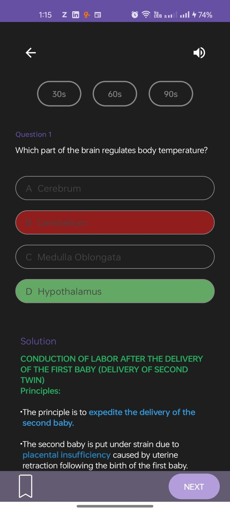

# Infinite Quiz - Technical Specification Document

## Objective
Infinite Quiz is an Android application designed to deliver an endless quiz experience. The app fetches and presents questions continuously and displays quiz results after every five questions. It integrates features such as background music, timed sessions, and detailed solutions to enhance the user experience.

---

## Architecture
The app is structured using the **Android Clean Architecture** pattern, incorporating **MVVM (Model-View-ViewModel)** principles to promote a clean separation of concerns. Dependency injection is managed using **Hilt**.
To enhance app performance, use **Gzip** to compress data before saving to the local db.

---

## Tech Stack
- **UI Framework**: Jetpack Compose with Material 3
- **Dependency Injection**: Hilt
- **Networking**: Retrofit
- **Local Storage**: Room Database
- **Image Loading**: Coil
- **Asynchronous Programming**: Kotlin Coroutines
- **Compression**: Gzip

---

## Features
1. **Start Test**
   - On tapping "Start Test," the app fetches the question list from the server.

2. **Question Flow**
   - Questions are shown one at a time.
   - Users can navigate using "Next" or "Skip."

3. **Background Music**
   - Plays automatically when the quiz starts.
   - Music can be paused/resumed by the user.

4. **Timer Selection**
   - Users must select a time limit before starting the quiz: 30s, 60s, or 90s per question.

5. **Answer Selection & Feedback**
   - Once an option is selected:
     - Correct answer is highlighted in **green**.
     - Incorrect options are highlighted in **red**.
     - Detailed solution is shown post-selection.

6. **Results & Stats**
   - A statistics screen is shown after every 5 questions, summarizing performance.

7. **Bookmarking**
   - Users can bookmark any question to revisit later.

8. **Sharing Solutions**
   - Solutions can be shared via other applications (e.g., messaging, email, social media).

---

## API Endpoint
- **Fetch Questions**: `https://6789df4ddd587da7ac27e4c2.mockapi.io/api/v1/mcq/content`

### Sample API Response Format
```json
{
  "uuidIdentifier": "question_id",
  "questionType": "text",
  "question": "What is your question?",
  "option1": "First option text",
  "option2": "Second option text",
  "option3": "Third option text",
  "option4": "Fourth option text",
  "correctOption": 1,
  "sortOrder": 1,
  "solutions": [
    {
      "contentType": "text",
      "contentData": "Solution explanation in text format."
    },
    {
      "contentType": "htmlText",
      "contentData": "<p>Solution explanation in HTML format.</p>"
    },
    {
      "contentType": "image",
      "contentData": "image_url_here"
    }
  ]
}
```

---

## Notes
- Network errors, timeouts, and empty responses are gracefully handled with appropriate user feedback.
- All business logic resides in UseCases, ensuring clean separation between UI and data layers.
- State management is handled via Compose `State` and `StateFlow`.

---

## Future Enhancements (Optional)
- User login and profile tracking
- Leaderboards or performance graphs
- Offline quiz mode using Room cached data
- Support for different question types (image-based, audio, etc.)

---

## Conclusion
Infinite Quiz leverages modern Android tools and practices to provide an engaging and seamless quiz experience. Its modular and scalable architecture ensures ease of maintenance and potential feature expansion.

## Screenshots





